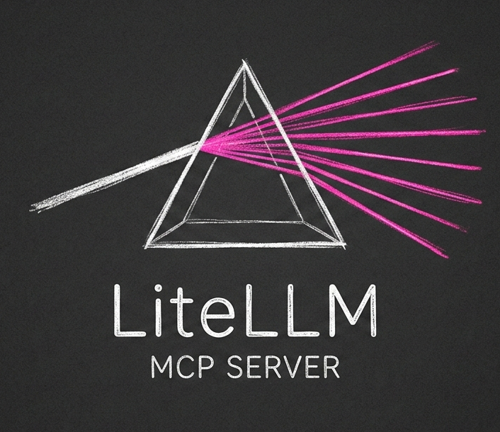
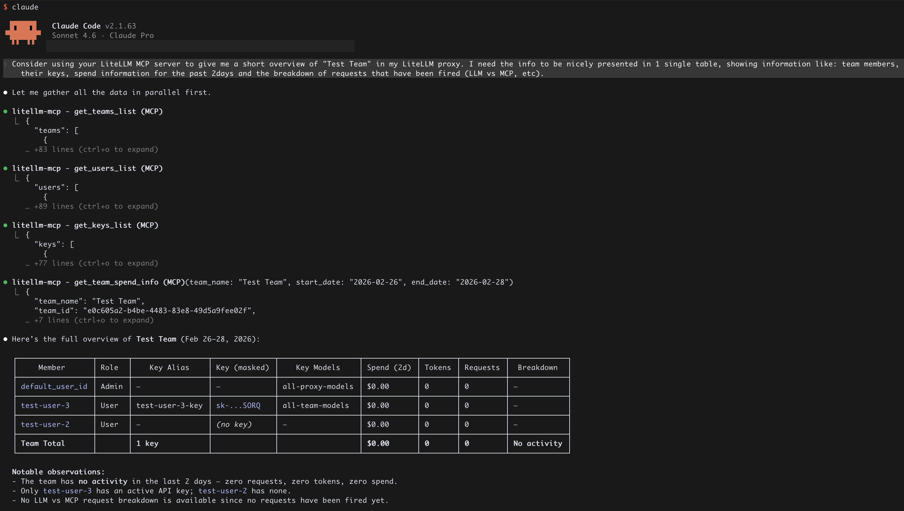
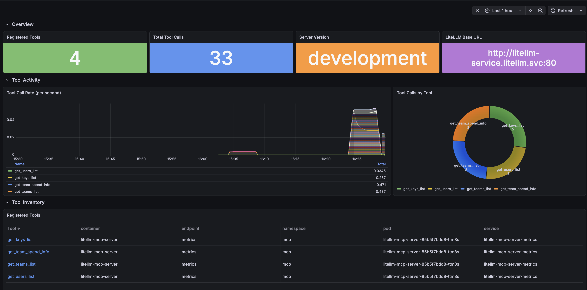

# LiteLLM MCP Server



----

Give your AI agent read-only visibility into your [LiteLLM](https://docs.litellm.ai/) proxy to query users, teams, API keys, and spend data through the Model Context Protocol.

> [!IMPORTANT]
> This MCP server exposes **read-only** tools by design. It will never mutate your proxy. Configuration changes should go through your LiteLLM `config.yaml`.



---

- [LiteLLM MCP Server](#litellm-mcp-server)
  - [Why use this?](#why-use-this)
  - [Available tools](#available-tools)
  - [Quick start](#quick-start)
    - [1. Configure](#1-configure)
    - [2. Install](#2-install)
    - [3. Run](#3-run)
  - [Connect to Claude Code](#connect-to-claude-code)
  - [Deployment](#deployment)
    - [Docker](#docker)
    - [Kubernetes](#kubernetes)
  - [Example prompt](#example-prompt)
  - [📊 Grafana Dashboard](#-grafana-dashboard)
  - [Project status](#project-status)

---

## Why use this?

Your LiteLLM proxy manages access, spend, and model routing across your entire org but querying it manually means digging through the UI or making raw API calls. This MCP server bridges that gap:

- **Ask in plain English.** Let an AI agent cross-reference teams, users, and keys for you instead of writing queries yourself.
- **Audit at a glance.** Instantly surface who has access to what models, which keys are orphaned, and where spend is concentrated.
- **Safe by design.** Every tool is read-only. No accidental mutations, no write permissions to hand out.
- **Composable.** Any MCP-compatible client (nClaude Code, Claude Desktop, custom agents ) can connect over HTTP with zero extra setup.

---

## Available tools
> This list will grow over time

| Tool | Description |
|---|---|
| `get_teams_list` | List all teams |
| `get_users_list` | List all users with resolved team names |
| `get_keys_list` | List all API keys with resolved team names |
| `get_team_spend_info` | Aggregated spend breakdown by model for a specific team and date range |

---

## Quick start

### 1. Configure

```bash
cp .env.example .env
```

Edit `.env` with your proxy details:

```env
LITELLM_BASE_URL=http://localhost:8081
LITELLM_API_KEY=your_admin_key_here

# Optional — defaults shown
MCP_SERVER_LOGGING_LEVEL=INFO
MCP_SERVER_PORT=8000
```

### 2. Install

```bash
uv sync
```

### 3. Run

```bash
make run
```

This runs `uv run python ./src/litellm_mcp_server/mcp_server.py` and starts the server on port `8000`.

---

## Connect to Claude Code

Add the server to your Claude Code MCP settings:

```json
{
  "mcpServers": {
    "litellm-mcp": {
      "type": "http",
      "url": "http://localhost:8000/mcp"
    }
  }
}
```

Or add it via the CLI:

```bash
claude mcp add --transport http litellm-mcp "http://localhost:8000/mcp" --scope user
```

Then ask Claude something like:

> *"Give me a full overview of this LiteLLM proxy: list all teams, users, and API keys. Summarize who has access to what."*

---

## Deployment

### Docker

```bash
# Build
make docker-build

# Run (port 8000 exposed)
make docker-run
```

The image is built on `python:3.14-alpine` and managed with `uv`. Environment variables are passed at runtime via `-e` flags or an env file.

### Kubernetes

Manifests live in `kube/`. The default setup targets a KIND cluster named `homelab`, but any cluster works.

**1. Create your secret**

```bash
cp kube/secret.yaml.example kube/secret.yaml
```

Populate with base64-encoded values:

```yaml
data:
  LITELLM_BASE_URL: <base64-encoded-value>
  LITELLM_API_KEY: <base64-encoded-value>
```

**2. Deploy**

```bash
make deploy
```

This builds the Docker image, loads it into the KIND cluster, and applies all manifests in `kube/`.

---

## Example prompt

> Using the available tools, produce a single summary table of my LiteLLM gateway with one row per team.
> Columns: Team, Models Allowed, Users & Keys (format as `username → key alias`, one per line), Total Spend, Total Requests.
> Below the table add 2–3 bullet points with the most important findings.

```
┌─────────────┬──────────────────┬───────────────────────────────────────────────┬─────────────┬────────────────┐
│    Team     │  Models Allowed  │                 Users & Keys                  │ Total Spend │ Total Requests │
├─────────────┼──────────────────┼───────────────────────────────────────────────┼─────────────┼────────────────┤
│ Admins      │ all-proxy-models │ admin-user → —                                │ $0.00       │ 0              │
│             │                  │ (service acct) → svc-admin                    │             │                │
├─────────────┼──────────────────┼───────────────────────────────────────────────┼─────────────┼────────────────┤
│ Developers  │ gpt-4.1-mini     │ software-eng → —                              │ $0.00       │ 0              │
├─────────────┼──────────────────┼───────────────────────────────────────────────┼─────────────┼────────────────┤
│ Engineering │ gpt-5.2          │ developer-1 → —                               │ $0.06       │ N/A            │
│             │                  │ engineer-1 → Codex                            │             │                │
├─────────────┼──────────────────┼───────────────────────────────────────────────┼─────────────┼────────────────┤
│ Platform    │ all-proxy-models │ developer-2 → dev-2-key                       │ $0.00       │ 0              │
│             │                  │ engineer-1 → eng-1-key                        │             │                │
└─────────────┴──────────────────┴───────────────────────────────────────────────┴─────────────┴────────────────┘

Key findings:
- Engineering is the only active team — 100% of gateway spend ($0.06) comes from the single Codex
  key, all on gpt-5.2.
- Access control gap: engineer-1 is a Platform member but holds the only Engineering key (Codex),
  giving them cross-team access to gpt-5.2 beyond their Platform entitlement.
- Admins team uses a keyless service account pattern: svc-admin has no user_id, making individual
  usage attribution impossible.
```

---

## 📊 Grafana Dashboard

A pre-built Grafana dashboard is included in [`dashboard/grafana.json`](dashboard/grafana.json). 



<br>

---

## Project status

| Capability | Status |
|---|---|
| List teams | ✅ |
| List users with team resolution | ✅ |
| List API keys with team resolution | ✅ |
| Team spend breakdown by model | ✅ |
| Docker image | ✅ |
| Kubernetes manifests | ✅ |
| Per-user spend breakdown | 🚧 Planned |
| Per-key spend breakdown | 🚧 Planned |
| MCP authentication | 🚧 Planned |

---

> This project is not affiliated with, endorsed by, or sponsored by [BerriAI](https://github.com/BerriAI/litellm). "LiteLLM" is a trademark of its respective owner and is used here for descriptive purposes only.
